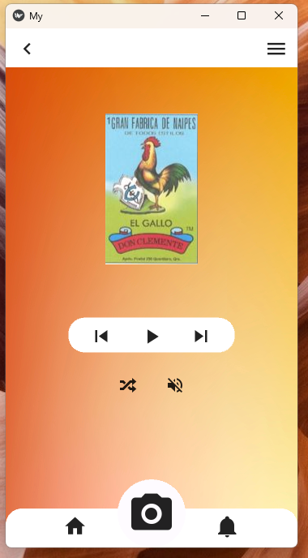
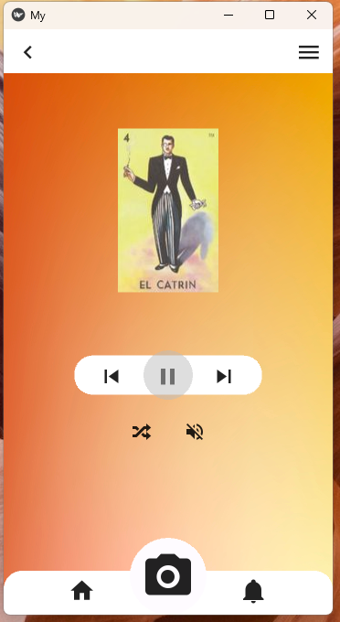

# Loteria AI

## Overview

Loteria AI is a Kivy-based application that simulates the traditional Loteria card game. It consists of two screens: `FirstScreen` and `SecondScreen`. The first screen welcomes users with a label and a button to navigate to the second screen. The second screen provides an interactive interface for viewing Loteria card images, with options for shuffling, playing, and pausing the card images. The application also utilizes text-to-speech functionality to announce the name of the displayed card.

## Installation

Make sure you have the required dependencies installed:

```bash
pip install kivy pyttsx3
```
## Dependencies
* Kivy
* pyttsx3

## File Structure
main.py: Main application file.
loteriaCards/: Directory containing Loteria card images.
screenshots/: Background image used in screens.

## Usage
To run the application, execute the following command:
```bash
python main.py
```
## Features
* Voice Guidance: The application uses text-to-speech to announce the name of the displayed Loteria card.
* Playback Control: Users can play, pause, rewind, and forward through the sequence of Loteria card images.
* Interactive Interface: The second screen provides a user-friendly interface for a dynamic Loteria experience.
## In Progress
The project is currently in the works to add the following features:

* AI Integration: Implementing artificial intelligence to enhance the gaming experience.
* Camera Functionality: Adding a camera function to identify winning cards, bringing a new level of interactivity.
## Screenshots



